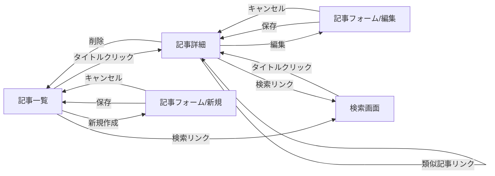

# Railsベクター検索デモ 機能設計書

**機能名**: ブログ記事の類似検索デモ
**機能ID**: VECTOR-DEMO-01
**バージョン**: 1.0
**作成日**: 2026年5月6日
**更新日**: 2026年5月6日

> **設計方針**
>
> 本機能設計書は、実装の詳細に影響されないコアドメインの設計を記載する。
> 採用する具体的な埋め込みモデル・ベクターDB・gem・類似度指標は ADR で決定するため、
> 本書ではそれらに依存しないインターフェースと責務分担を定義する。
> 用語は [用語集](../glossary/glossary.md) に従う。

## 1. 機能概要

### 1.1 目的

- Rails の標準的な構成要素（CRUD、ActiveJob、Hotwire）とベクター検索の組み合わせ方を、動作する形で提示する
- ブログ記事（以下、本書では「記事」と表記する）の類似検索を題材に、埋め込みベクトル生成・保管・類似度計算という一連の流れを設計と実装の両面で示す
- 完全にローカルで動作することで、読者が追体験しやすい構成とする

### 1.2 主要機能

1. **記事管理**: 記事のCRUD（一覧・詳細・新規・編集・削除）
2. **埋め込みベクトル生成・更新**: 記事の作成・更新時に、対象記事の埋め込みベクトルを ActiveJob により非同期で生成・保存する
3. **埋め込みベクトル削除**: 記事の削除時に、対応する埋め込みベクトルを削除する
4. **クエリ文による類似記事検索**: 利用者が入力したクエリ文の埋め込みベクトルを生成し、類似度の高い記事を上位件数まで返す
5. **類似記事提示**: 記事詳細画面に、当該記事の埋め込みベクトルに近い他記事を上位件数まで表示する

### 1.3 処理フロー概要

#### 1.3.1 記事の保存と埋め込み生成（書き込み系）

1. 利用者が記事フォームから記事を作成または更新する
2. `Article` を保存する（タイトル・本文をバリデーションして永続化）
3. 保存トランザクションのコミット直後に、`Article` モデルの `after_commit` コールバックが `ArticleEmbeddingJob` をエンキューする（同期処理は完了）
4. ジョブが非同期に実行され、対象記事のテキストから埋め込みベクトルを生成し、`ArticleEmbedding` として保存する（既存があれば更新）
5. ジョブが失敗した場合、ActiveJob の `retry_on` により自動再試行する
6. 最終的にジョブが失敗した場合の挙動:
   - **新規作成時**: 当該記事は埋め込みベクトル未生成状態となり、検索結果には含まれない
   - **更新時**: 既存の埋め込みベクトルはそのまま残る（古い内容のまま）。`model_identifier` により旧バージョンであることが識別できるが、本デモでは過渡期の検索結果除外は行わない（§4.2.4 参照）

#### 1.3.2 クエリ文による類似記事検索（読み取り系）

1. 利用者が検索画面でクエリ文を入力し送信する
2. クエリ文を埋め込みベクトル化する（以下「クエリ文の埋め込みベクトル」と表記）
3. クエリ文の埋め込みベクトルと既存の `ArticleEmbedding` 群との類似度を計算し、上位 K 件の記事を取得する
4. 取得した記事のタイトルを類似度順で表示する（類似度スコア自体は表示しない）

#### 1.3.3 類似記事の提示（記事詳細）

1. 利用者が記事詳細画面を開く
2. 当該記事の `ArticleEmbedding` を取得する（未生成の場合は類似記事セクションに「準備中」と表示する）
3. 当該記事の埋め込みベクトルと他記事の `ArticleEmbedding` 群との類似度を計算し、上位 K 件を取得する（自記事は除外）
4. 取得した記事のタイトルを類似度順で表示する（類似度スコア自体は表示しない）

## 2. データ要件

### 2.1 永続データ

#### 2.1.1 記事

**論理名**: 記事（用語集の正式名称は「ブログ記事」）
**テーブル名（仮）**: `articles`

| 項目名 | キー | データ型 | 必須 | 説明 |
|--------|------|----------|------|------|
| id | PK | bigint | ○ | 主キー |
| title | | 文字列（短） | ○ | 記事タイトル |
| body | | 文字列（長） | ○ | 記事本文 |
| created_at | | datetime | ○ | 作成日時 |
| updated_at | | datetime | ○ | 更新日時 |

**制約**:
- `title` は空文字列を許容しない
- `body` は空文字列を許容しない

**データ作成/更新タイミング**:
- 作成: 記事フォームからの新規送信時
- 更新: 記事フォームからの編集送信時
- 削除: 記事詳細または一覧からの削除操作時

#### 2.1.2 記事の埋め込みベクトル

**論理名**: 記事の埋め込みベクトル
**テーブル名（仮）**: `article_embeddings`

| 項目名 | キー | データ型 | 必須 | 説明 |
|--------|------|----------|------|------|
| id | PK | bigint | ○ | 主キー |
| article_id | UK, FK | bigint | ○ | 対象記事への参照（1対1） |
| embedding | | ベクトル（固定次元） | ○ | 記事のテキストから生成された埋め込みベクトル（次元数は ADR A-2 で 768 に確定） |
| model_identifier | | 文字列（短） | ○ | 生成に用いた埋め込みモデルの識別子。形式は `<HFリポジトリ名>@<commit-sha>`（ADR A-2 で `Xenova/multilingual-e5-base@<commit-sha>` に確定） |
| created_at | | datetime | ○ | 作成日時 |
| updated_at | | datetime | ○ | 更新日時 |

**制約**:
- UNIQUE KEY (`article_id`)
- FOREIGN KEY (`article_id`) REFERENCES `articles` (`id`) ON DELETE CASCADE
- `embedding` の次元数は採用する埋め込みモデルに準拠する（ADR で確定）

**目的**:
- 記事と1対1で紐づく埋め込みベクトルを保持し、類似度計算の入力とする
- `model_identifier` を保持することで、埋め込みモデルを変更した際に再生成が必要なレコードを識別できるようにする（実際の再生成は手動バッチで対応する想定。§4.2.4 参照）

**データ作成/更新タイミング**:
- 作成・更新: 記事の作成または更新を契機とする `ArticleEmbeddingJob` の正常完了時
- 削除: 関連する記事の削除時に、ON DELETE CASCADE により自動削除

#### 2.1.3 物理層の前提

- `embedding` 列の物理表現およびインデックス方式は、採用するベクターDB（pgvector 等）に依存する。本書では論理モデルのみを規定し、物理表現の選定は ADR で行う
- 結果として `article_embeddings` が独立した RDB テーブルとして実装されるか、専用ベクターDBの索引として実装されるかは ADR の決定に委ねる。いずれの場合も「記事と1対1で対応し、ON DELETE CASCADE 相当の整合性が保たれる」要件を満たすこと

### 2.2 派生データ

本機能には永続化を伴う派生データはない。検索のたびに類似度計算結果を生成し、レスポンスとして返す。

## 3. 計算ロジック

### 3.1 埋め込みベクトル生成

```
入力: 記事のテキスト（タイトルと本文を結合した文字列）
処理: 採用する埋め込みモデルに入力し、固定次元の数値ベクトルを得る
出力: 埋め込みベクトル と モデル識別子
```

**仕様**:
- 入力テキストの構成: `タイトル + 改行 + 本文`
- テキスト結合の責務: **呼び出し側**（`ArticleEmbeddingJob` および `SearchesController` 相当）が結合済みのテキストを `EmbeddingModel` に渡す。`EmbeddingModel` は単一の文字列を入力として扱う
- モデル側のトークン上限を超える場合の方針は ADR で確定
- 出力次元: 採用する埋め込みモデルに依存

### 3.2 類似度計算

```
入力: 比較元ベクトル、比較先ベクトル群
処理: 各ベクトル間の類似度を計算する
出力: 類似度スコア（または距離）と対象識別子の対応リスト、類似度の高い順にソート
```

**仕様**:
- 採用する類似度指標（コサイン類似度／内積／ユークリッド距離 等）は ADR で確定
- 採用する指標に応じて「高い類似度＝小さい距離」または「高い類似度＝大きいスコア」のいずれかとなるが、結果は常に「最も類似する順」で返すこと

### 3.3 類似記事の取得（top-K）

```
入力: 比較元ベクトル、除外対象の記事ID（任意）、K
処理: 類似度計算の結果から、除外対象を除いて類似度の高い上位 K 件の記事を取得する
出力: 記事のリスト（K 件以下、類似度順）。本デモでは類似度スコア自体は出力に含めない
```

**仕様**:
- 検索画面における K の値: **10**
- 記事詳細「類似記事」セクションにおける K の値: **5**
- 除外対象: 記事詳細から呼び出された場合は当該記事自身を除外、検索画面からは除外なし
- スコア表示の取り扱い: 本デモではタイトルのみを表示するため、スコアは出力に含めない（用途追加が必要な場合は出力に追加可能だが、現状はビュー側でも参照しない）

## 4. ビジネスルール

### 4.1 記事の整合性

#### 4.1.1 タイトル・本文の必須化
- **項目**: `title`, `body`
- **規則**: いずれも空文字列を許容しない
- **目的**: 検索結果として意味のある記事のみを保持する
- **失敗時挙動**: 記事フォームでバリデーションエラーを表示し、保存しない

### 4.2 埋め込みベクトルの整合性

#### 4.2.1 記事と埋め込みベクトルの1対1関連
- **規則**: 1つの記事に対して有効な埋め込みベクトルは1件のみ
- **目的**: 検索時に重複したヒットや古い結果が発生しないようにする
- **更新時の扱い**: 記事更新時は既存の埋め込みベクトルを上書き更新する（ジョブが正常完了した場合）

#### 4.2.2 記事削除時の連動削除
- **規則**: 記事を削除した場合、対応する埋め込みベクトルも削除する
- **目的**: 削除済み記事が検索結果に現れることを防ぐ
- **実現手段**: ON DELETE CASCADE または同等の挙動

#### 4.2.3 埋め込みベクトル未生成記事の検索結果除外
- **規則**: 埋め込みベクトルが未生成の記事は、検索結果および類似記事セクションに含めない
- **目的**: 不完全な状態の結果を返さない
- **発生しうる状況**: 新規作成記事のジョブが retry_on の上限に達して失敗した、または非同期処理が完了する前に検索が実行された

#### 4.2.4 モデル変更時の過渡期の取り扱い
- **規則**: 採用する埋め込みモデルを変更した場合、`model_identifier` が新旧で混在する期間が発生しうる
- **本デモの方針**: 過渡期の検索結果除外は行わない。`model_identifier` は識別目的でのみ保持し、モデル変更時は手動の再生成バッチ（全 `Article` に対して `ArticleEmbeddingJob` を再エンキュー）で揃える運用を前提とする
- **目的**: デモのスコープに過剰な状態管理を持ち込まない

### 4.3 検索動作

#### 4.3.1 空クエリ文の扱い
- **規則**: クエリ文が空文字列または空白のみの場合、検索を実行しない
- **目的**: 無意味な検索を防ぐ
- **挙動**: 入力を促す表示にとどめる

#### 4.3.2 自記事の除外
- **規則**: 記事詳細の「類似記事」セクションでは、表示中の記事自身を結果から除外する
- **目的**: 自明な結果（自分自身が最も似ている）を排除する

## 5. 画面表示機能

### 5.1 画面構成

#### 5.1.1 画面一覧

| 画面 | URL（仮） | 主な内容 |
|------|----------|---------|
| 記事一覧画面 | `/articles` | 投稿済み記事のタイトル一覧、新規作成リンク、検索画面への導線 |
| 記事詳細画面 | `/articles/:id` | タイトル、本文、編集・削除リンク、類似記事セクション |
| 記事新規作成画面 | `/articles/new` | 記事フォーム（タイトル、本文） |
| 記事編集画面 | `/articles/:id/edit` | 記事フォーム（タイトル、本文） |
| 検索画面 | `/search` | クエリ文入力フォーム、検索結果一覧 |

#### 5.1.2 共通レイアウト

- **ヘッダー**: アプリ名、記事一覧へのリンク、検索画面へのリンク
- **メイン領域**: 各画面固有の内容
- **フッター**: 最小限（OSS リポジトリへのリンクなど）

#### 5.1.3 記事一覧画面

- **領域**: 記事タイトルのリスト
- **行ごとの表示項目**: タイトル（記事詳細へのリンク）、作成日時
- **アクション**: 「新規作成」ボタン

#### 5.1.4 記事詳細画面

- **本文領域**: タイトル、本文、作成日時・更新日時
- **アクション**: 「編集」「削除」ボタン
- **類似記事セクション**: ヘッダー「類似記事」、上位5件の記事タイトル一覧（各タイトルは記事詳細へのリンク）。類似度スコアは表示しない。当該記事の埋め込みベクトルが未生成の場合は「準備中」のメッセージを表示する

#### 5.1.5 記事フォーム（新規・編集共通）

- **入力項目**: タイトル（テキスト1行）、本文（複数行）
- **アクション**: 「保存」「キャンセル」
- **キャンセル時の遷移先**: 新規時は記事一覧、編集時は当該記事詳細
- **エラー表示**: バリデーションエラーをフォーム上部または該当項目近傍に表示

#### 5.1.6 検索画面

- **入力領域**: クエリ文の入力フォーム（テキスト1行）、「検索」ボタン
- **結果領域**: クエリ送信後に上位10件の記事タイトル一覧を表示。各タイトルは記事詳細へのリンク。類似度スコアは表示しない
- **空クエリ時**: 結果領域を更新せず、入力を促す表示
- **結果0件時**: 「該当する記事がありません」のメッセージ表示

### 5.2 画面遷移と更新方式



**Hotwire の活用方針**:
- 検索画面の結果領域は **Turbo Frame として実装する**（フォーム送信時に結果領域のみを差し替え、全画面リロードを行わない）
- 記事詳細の「類似記事」セクションも **Turbo Frame として実装する**（埋め込みベクトル未生成時の「準備中」表示および後続の差し替えに備える）
- その他の画面遷移は Turbo Drive による標準的なナビゲーションとする
- Stimulus は必要最小限とし、本デモでは削除確認ダイアログ等の用途に限定する

### 5.3 エラーおよび状態通知

#### 5.3.1 分類

| レベル | 内容 | 処理継続 | 利用者通知 |
|-------|------|----------|-----------|
| バリデーションエラー | 記事フォームの入力不備（必須項目空 等） | 中止（保存しない） | 画面上で表示 |
| 状態通知（エラーではない） | 当該記事の埋め込みベクトル未生成 | 当該セクションのみ「準備中」表示 | 画面上で表示 |
| 内部エラー | ベクターDB側の検索失敗（接続エラー・タイムアウト 等） | 検索処理を中止 | 「検索に失敗しました」相当のメッセージ |
| 内部エラー | 検索処理時のクエリ文の埋め込み生成失敗 | 検索処理を中止 | 「検索に失敗しました」相当のメッセージ |
| 非通知 | `ArticleEmbeddingJob` の最終失敗 | 記事保存自体は成功扱い | 画面では通知しない（スコープ外） |

## 6. システム構成と責務分担

### 6.1 主要コンポーネントと責務

| コンポーネント | 種別 | 責務 |
|--------------|------|------|
| `Article` | ActiveRecord モデル | 記事の永続化・バリデーション。`after_commit` で `ArticleEmbeddingJob` をエンキューする責務を持つ |
| `ArticleEmbedding` | ActiveRecord モデル | 埋め込みベクトルの永続化。`Article` と1対1で関連 |
| `ArticleEmbeddingJob` | ActiveJob | 指定された記事を対象に、埋め込みベクトル生成 → 保存を行う。失敗時は `retry_on` で自動再試行 |
| `EmbeddingModel`（インターフェース） | アプリケーション層の抽象 | 結合済みテキストを受け取り、埋め込みベクトルとモデル識別子を返す。具体実装は ADR で決定 |
| `VectorSearch`（インターフェース） | アプリケーション層の抽象 | 比較元ベクトルと除外対象から、上位 K 件の記事を返す。具体実装は ADR で決定 |
| `ArticlesController` | コントローラ | 記事の CRUD と詳細表示。詳細では `VectorSearch` を呼び出して類似記事を取得 |
| `SearchesController` | コントローラ | クエリ文の受け取り、`EmbeddingModel` でクエリ文の埋め込みベクトル化、`VectorSearch` で結果取得 |
| ビュー（ERB + Turbo Frame） | プレゼンテーション層 | 各画面のレンダリング。検索結果と類似記事は Turbo Frame で表現 |

### 6.2 抽象インターフェース

#### 6.2.1 `EmbeddingModel`

| メソッド責務 | 入力 | 出力 |
|------------|------|------|
| テキストの埋め込みベクトル化 | テキスト（文字列。呼び出し側が結合済みのもの） | 埋め込みベクトル（固定次元の数値配列）、モデル識別子（モデル名 + バージョン形式の文字列） |

- 入力テキストの結合は呼び出し側の責務（§3.1 参照）
- 入力テキストの正規化・トークン上限対応は実装側に委譲する
- 同期メソッドとして提供する（呼び出し側が `ArticleEmbeddingJob` 内部・コントローラのいずれであっても、ブロッキング呼び出しとなる）

#### 6.2.2 `VectorSearch`

| メソッド責務 | 入力 | 出力 |
|------------|------|------|
| 比較元ベクトルから類似記事を取得 | 比較元ベクトル、除外記事ID（任意）、K | 記事のリスト（最大 K 件、類似度順） |

- 類似度指標と内部の検索アルゴリズム（線形走査／ANN 索引）の選択は実装側に委譲する
- 「除外記事ID」が指定された場合、結果に含めないこと
- 出力には類似度スコア自体は含めない（§3.3 参照）

### 6.3 抽象化の境界とローカル動作制約

- `EmbeddingModel` と `VectorSearch` は **どちらもアプリケーション層に属する抽象** とし、コントローラ・ジョブ・ビュー層からは具体実装に依存しない形で利用する
- 具体実装は ADR の決定に基づき、Rails の DI 機構（典型的には初期化子＋依存注入用のレジストリ、または定数経由の差し替え）で配線する。具体配線方式は実装段階の選択とする
- **ローカル動作制約**: いずれの抽象実装も、外部 API への通信を行わず、ローカルプロセス（および Docker Compose 内の同一ネットワーク上のコンテナ）のみで動作するものを採用すること（要件定義書 §3.2）
- この抽象化により、ADR の決定（採用する埋め込みモデル・ベクターDB）を後から変更しても、コントローラ・ジョブ・ビューのコードを書き換えずに差し替え可能となる

## 7. 自動更新（埋め込みベクトル生成）機能

### 7.1 トリガーイベント

- `Article` の作成または更新成功時の `after_commit` コールバック（INSERT/UPDATE のコミット後に発火）

### 7.2 前提条件

- `EmbeddingModel` 実装が利用可能であること
- `ArticleEmbedding` を保存できる状態にあること

### 7.3 ジョブの責務

1. 引数として渡された `article_id` から `Article` を取得
2. `Article` が既に削除されている場合は何もせず終了
3. `EmbeddingModel` に「タイトル + 改行 + 本文」のテキストを渡し、埋め込みベクトルとモデル識別子を取得
4. `ArticleEmbedding` を作成または更新（`article_id` をキーとする upsert）
5. 失敗した場合、ActiveJob の `retry_on` で再試行

### 7.4 失敗時の挙動

- ジョブの失敗は記事保存の成否に影響しない（既に記事は保存済み）
- 失敗時の利用者通知は行わない（スコープ外）
- 最終失敗時の埋め込みベクトル状態:
  - **新規作成記事**: 埋め込みベクトルは未生成のままとなり、検索結果には含まれない
  - **更新記事**: 既存の埋め込みベクトルがそのまま残る（古い内容のまま検索結果に含まれる）。本デモでは過渡期の除外は行わない（§4.2.4 参照）

### 7.5 並行実行の取り扱い

- 同一記事に対して複数のジョブが連続的にエンキューされた場合（短時間に連続更新が発生 等）、最後に成功したジョブの結果が `article_id` をキーとした upsert により最終状態となる
- 厳密な順序保証は行わない。本デモのスコープ（単一利用者・低頻度更新）では、これによる実害は想定しない

## 8. seed データ

### 8.1 目的

- 追体験を行う読者が、リポジトリのクローン直後から類似検索の動作を確認できるようにする
- 類似度計算の結果に意味のある差が現れる程度の多様性を持つ初期データを提供する

### 8.2 構成

- 件数: 20〜50件
- テーマ分布の指針: 概ね 4〜6 のテーマ（例: Rails、Ruby 文法、データベース、フロントエンド、運用 等）にまたがり、各テーマあたり 4〜10 件程度の記事を含むこと。これにより、あるテーマのクエリ文に対して同テーマの記事群が上位に集まることを確認できる
- 内容: 受入条件「明らかに関連する記事が上位に来る」を満たす程度の差が出る記述を含むこと
- 生成方法: Claude Code 等で生成したテキストを `db/seeds.rb` から投入

### 8.3 seed 投入時の埋め込み生成

- seed 投入時にも `Article` の `after_commit` コールバックが発火し、`ArticleEmbeddingJob` がエンキューされる
- ローカル開発環境では、seed 投入後にジョブワーカーを起動して埋め込みベクトル生成を完了させる必要がある
- README にこの手順を明記する

## 9. 受け入れ条件との対応

| 要件定義書の受入条件 | 対応する設計箇所 |
|---------------------|----------------|
| 記事の CRUD と閲覧 | §1.2-1, §2.1.1, §5.1.3〜5.1.5, §6.1 |
| 記事の作成・更新時に埋め込みベクトルが非同期生成・更新 | §1.3.1, §7 |
| 記事の削除時に埋め込みベクトルが削除 | §2.1.2 制約, §4.2.2 |
| `retry_on` による再試行 | §1.3.1, §7.4 |
| クエリ文による類似記事の上位件数取得 | §1.3.2, §3.3, §5.1.6 |
| 記事詳細の類似記事セクション（自記事除外） | §1.3.3, §4.3.2, §5.1.4 |
| seed 投入後の検索動作確認 | §8 |
| 完全ローカル動作 | §6.3（ローカル動作制約として明記）、§9 注記 |
| README の手順による再現可能性 | §8.3 |

---

## 関連資料

- [要件定義書](../requirements/requirements.md)
- [用語集](../glossary/glossary.md)

## 改訂履歴

| バージョン | 日付 | 変更内容 |
|------------|------|----------|
| 1.0 | 2026/05/06 | 初版作成 |
